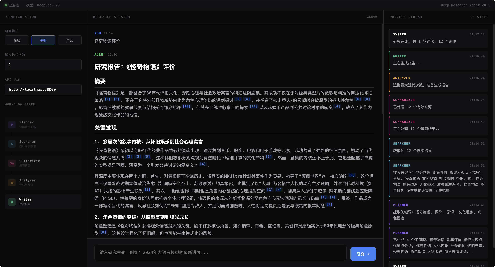
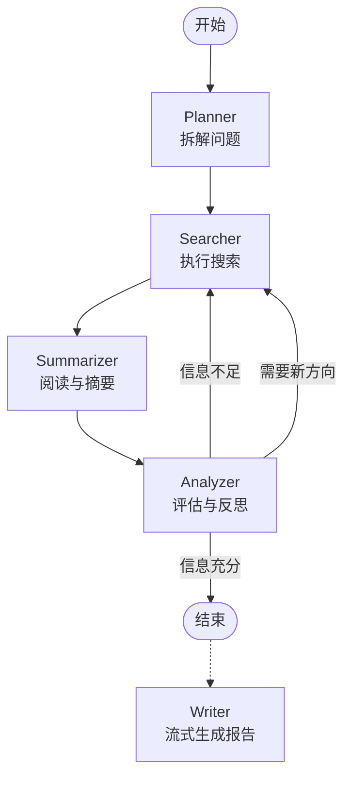

# Deep Research Agent 🕵️‍♂️

> 🎓 **说明**：这是一个实现很简单的期末课程项目 (Course Project)。旨在演示如何利用 LangGraph 和 LLM 构建自主智能体，功能设计较为精简，主要用于学习和验证概念。

 
 
 


**Deep Research Agent** 是一个基于 **LangGraph** 和 **DeepSeek** 构建的智能深度调研助手。它能够自主拆解复杂问题、执行多轮深度搜索、阅读分析网页内容，并最终生成一份包含精准引用的专业研究报告。

与传统搜索工具不同，它具备**自我反思**能力：如果发现当前信息不足以回答问题，它会自动生成新的搜索方向继续挖掘，直到收集到足够的信息为止。

## 📸 界面预览

<div align="center">
  
  <p><i>实时流式输出 + 工作流可视化 + 引用标注</i></p>
</div>

---

## ✨ 核心特性

- **🧠 智能规划**：自动将模糊的用户问题拆解为具体的搜索子任务。
- **🔄 自主迭代**：内置 Analyzer 节点，实时评估信息覆盖度，自动决定是否需要补充搜索。
- **🌊 极致流式体验**：Token 级流式输出，配合打字机效果，告别漫长等待。
- **📚 精准引用系统**：生成的报告中每一处关键论点都会标注 `[1]` `[2]` 形式的引用。
- **🔍 多种研究模式**：
  - **深度模式 (Depth)**：专注于深挖单一主题的底层逻辑和技术细节。
  - **广度模式 (Breadth)**：致力于覆盖主题的各个侧面，适合行业综述。
  - **平衡模式 (Balanced)**：智能结合广度扫描与深度挖掘（默认推荐）。
- **🔘 最大迭代次数**：如果搜索内容质量不够好 Agent 会迭代搜索直到质量合格或达到最大迭代次数。
- **📊 实时可视化**：前端界面实时展示 Agent 的思考路径和当前执行状态。

## 🚀 快速开始

### 前置要求

- Python 3.10+
- [DeepSeek API Key](https://platform.deepseek.com/)
- [Tavily API Key](https://tavily.com/) (用于网络搜索)

### 1. 克隆项目

```bash
git clone git@github.com:BlueMAX111/deep-research-agent.git
cd deep-research-agent
```

### 2. 安装依赖

建议使用虚拟环境：

```bash
python -m venv venv
source venv/bin/activate  # Windows: venv\Scripts\activate
pip install -r requirements.txt
```

### 3. 配置环境变量

复制 `.env.example` 为 `.env` 并填入你的 API Key：

```bash
cp .env.example .env
```

编辑 `.env` 文件：

```ini
DEEPSEEK_API_KEY=sk-your-key-here
TAVILY_API_KEY=tvly-your-key-here
```

### 4. 运行服务

启动后端服务：

```bash
python run.py
```

打开前端页面：

```bash
open index.html
```

### 5. 开始研究

选择研究模式并输入最大迭代次数，然后输入你感兴趣的研究主题（例如："GTA6 最新发布情况"），即可开始调研。

## 🏗️ 系统架构

本项目基于 **LangGraph** 状态机构建，核心工作流如下：



- **Planner**: 理解用户意图，生成初始搜索关键词。
- **Searcher**: 调用 Tavily API 获取网页内容。
- **Summarizer**: 使用 LLM 提取网页核心信息，过滤无关内容。
- **Analyzer**: 这是一个"反思"节点，它检查收集到的信息是否足以回答用户问题。如果不足，它会生成新的搜索指令，触发下一轮迭代。
- **Writer**: 当信息充足时，利用收集到的所有上下文，流式生成最终的 Markdown 报告。

## 🛠️ 技术栈

- **Backend Framework**: [FastAPI](https://fastapi.tiangolo.com/)
- **Agent Framework**: [LangGraph](https://langchain-ai.github.io/langgraph/)
- **LLM**: DeepSeek-V3 (via OpenAI SDK compatibility)
- **Search Tool**: Tavily Search API
- **Frontend**: Vanilla HTML/JS + SSE (Server-Sent Events)

## ⚙️ 配置选项

在 `.env` 文件中可以调整以下参数来控制 Agent 的行为：

| 参数 | 说明 | 默认值 |
|------|------|--------|
| `DEFAULT_MAX_ITERATIONS` | 最大搜索迭代轮数，防止无限循环 | 3 |
| `DEFAULT_MAX_DETAIL_FETCHES` | 每次迭代最大深入阅读的网页数量 | 5 |
| `DEFAULT_MODE` | 默认研究模式 (depth/breadth/balanced) | balanced |

## 🤝 贡献指南

欢迎提交 Pull Request！如果你有好的想法，请先提交 Issue 讨论。

1. Fork 本仓库
2. 创建你的特性分支 (`git checkout -b feature/AmazingFeature`)
3. 提交你的修改 (`git commit -m 'Add some AmazingFeature'`)
4. 推送到分支 (`git push origin feature/AmazingFeature`)
5. 开启一个 Pull Request

## 📄 许可证

本项目采用 [MIT License](LICENSE) 开源。
